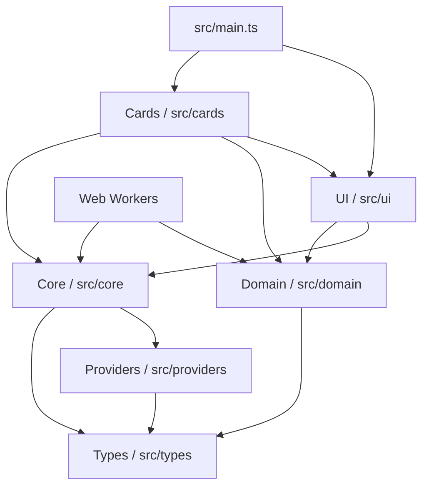
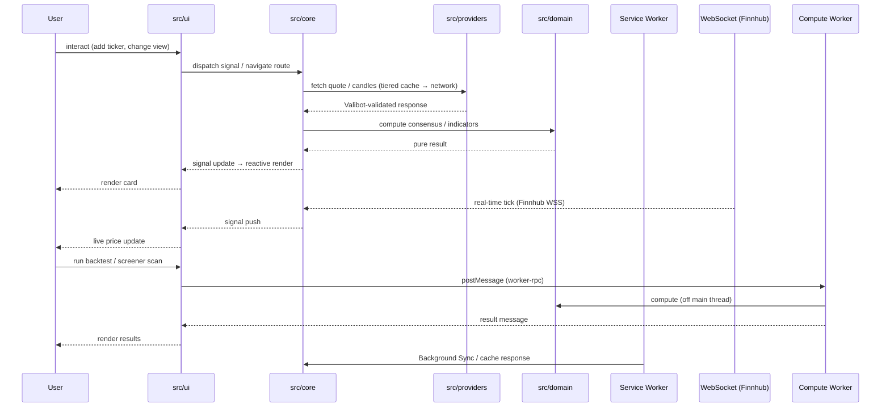

# Architecture

> **Last updated:** v7.0.0 (May 2026)

CrossTide Web is a browser-based stock monitoring dashboard built with vanilla TypeScript and Vite.
It follows a strict layered architecture, keeps the production bundle small, and ships as a
self-contained offline-first PWA with real-time streaming, multi-provider data, and Web Worker
compute offload.

## Layered architecture



**Dependency rule:** each layer may only import from layers below it. The domain layer is pure
(zero side effects, no DOM access). Web Workers share the domain and core layers.

## Runtime data flow



## Key product features (v7.0)

| Feature                    | Implementation                                                 |
| -------------------------- | -------------------------------------------------------------- |
| 30+ technical indicators   | `src/domain/*` — pure TS, exhaustive tests                     |
| 12-method consensus engine | `src/domain/consensus-engine.ts`                               |
| Interactive charting       | `lightweight-charts@^5` via `src/cards/lw-chart.ts`            |
| Multi-chart layout         | `src/cards/multi-chart-layout.ts` — 2×2 / 1+3 synced crosshair |
| Drawing tools              | Trendline + Fibonacci retracement canvas overlay               |
| Real-time streaming        | Finnhub WebSocket via `src/core/reconnecting-ws.ts`            |
| Screener (preset + custom) | `src/cards/screener-card.ts` + off-thread compute              |
| Sector heatmap             | Canvas treemap `src/cards/heatmap-card.ts`                     |
| Portfolio + risk metrics   | Sharpe, Sortino, max DD, CAGR, equity curve                    |
| Backtest engine            | `src/domain/backtest-engine.ts` + Web Worker + equity curve UI |
| Alert state machine        | `src/domain/alert-state-machine.ts` + in-browser notifications |
| Offline-first PWA          | Workbox: precache + NetworkFirst/SWR + Background Sync         |
| Command palette (`⌘K`)     | `src/ui/command-palette.ts` + fuzzy match                      |
| Keyboard-first             | `src/core/keyboard.ts` — `j/k`, `/`, `g+h`, Vim-style nav      |
| i18n (EN + HE RTL)         | ICU message formatter + Intl formatters                        |
| Color-blind palettes       | deuteranopia, protanopia, tritanopia, high-contrast            |
| Cross-tab sync             | BroadcastChannel `src/core/broadcast-channel.ts`               |

## Directory layout

```text
src/
├── domain/         pure calculators (30+ indicators, consensus, backtest, risk, …)
├── core/           signals, cache, config, fetch, idb, worker-rpc, telemetry, …
├── providers/      market-data adapters (Yahoo, Finnhub, CoinGecko, Polygon, chain)
├── cards/          composable UI cards — 13 route cards, lazy-loaded via registry
├── ui/             DOM helpers, router, toast, modal, command palette, a11y
├── types/          shared interfaces + Valibot schemas for all provider boundaries
├── styles/         design tokens, base, responsive, components, palettes
└── main.ts         bootstrap: router, signals, keyboard, palette, cards, telemetry
```

## Runtime dependencies

| Package                | Purpose                     | Size (gz) |
| ---------------------- | --------------------------- | --------- |
| `lightweight-charts`   | Candlestick / line charting | ~45 KB    |
| `valibot`              | Runtime schema validation   | ~3 KB     |
| `@preact/signals-core` | Reactive state primitives   | ~1.4 KB   |

All other functionality is hand-written TypeScript — no framework runtime.

## Tooling — single source of truth

| Concern        | File                            | Notes                                                              |
| -------------- | ------------------------------- | ------------------------------------------------------------------ |
| TypeScript     | `tsconfig.json`                 | strict + `exactOptionalPropertyTypes` + `noUncheckedIndexedAccess` |
| Bundler        | `vite.config.ts`                | Vite 8, oxc minifier, ES2022                                       |
| Tests (unit)   | `vitest.config.ts`              | happy-dom, v8 coverage, 90% thresholds                             |
| Tests (E2E)    | `playwright.config.ts`          | Chromium, 15 critical flows + axe-core                             |
| Linting (TS)   | `eslint.config.mjs`             | ESLint 10 flat + typescript-eslint 8, `--max-warnings 0`           |
| Linting (CSS)  | `.stylelintrc.json`             | inline rule set                                                    |
| Linting (HTML) | `.htmlhintrc`                   | inline rule set                                                    |
| Linting (MD)   | `.markdownlint.json`            | `default: true`, allow common HTML elements                        |
| Format         | `.prettierrc`                   | repo-local; `npm run format:check` is the gate                     |
| Bundle budget  | `scripts/check-bundle-size.mjs` | 200 KB gzipped JS                                                  |
| Lighthouse     | `lighthouserc.json`             | Perf ≥ 85, A11y ≥ 90, Best ≥ 90                                    |
| Changesets     | `.changeset/config.json`        | Auto version + release PR                                          |

The repo is fully self-contained: `git clone` → `npm ci` → `npm run ci` works on any machine.

## CI / CD

| Workflow         | Trigger   | Purpose                                                     |
| ---------------- | --------- | ----------------------------------------------------------- |
| `ci.yml`         | push + PR | typecheck → lint:all → test:coverage → build → bundle check |
| `release.yml`    | tag `v*`  | gates + zip dist + SHA-256 + GitHub Release                 |
| `pages.yml`      | push main | deploy to GitHub Pages (mirror)                             |
| `cf-pages.yml`   | push + PR | Cloudflare Pages deploy (production + PR previews)          |
| `changesets.yml` | push main | Version PR or tag via @changesets/action                    |
| `lighthouse.yml` | push + PR | `lhci autorun` performance/a11y budgets                     |
| `dependabot.yml` | weekly    | npm + github-actions grouped update PRs                     |

## Quality gates

Local and CI both enforce, with **zero waivers**:

- 0 TypeScript errors (`npm run typecheck`)
- 0 ESLint warnings (`npm run lint`)
- 0 Stylelint warnings (`npm run lint:css`)
- 0 HTMLHint findings (`npm run lint:html`)
- 0 markdownlint findings (`npm run lint:md`)
- Prettier clean (`npm run format:check`)
- 2100+ unit tests pass (`npm test`), v8 coverage thresholds met
- 15 Playwright E2E flows + axe a11y audit pass
- Lighthouse CI budgets met
- Production build under 200 KB gzipped JS (`npm run check:bundle`)

## Security

- **CSP** enforced via Vite dev headers + `_headers` file (Cloudflare Pages)
- **SRI** hashes for preloaded scripts (`src/core/sri.ts`)
- **Valibot** validation at every external data boundary (Yahoo, Finnhub, CoinGecko, Polygon)
- **Token-bucket** rate limiter prevents API abuse
- **Circuit-breaker** per provider with automatic failover chain
- **No `innerHTML`** with user data — all DOM via `textContent` or sanitized templates
- **Dependabot** + dependency-review-action for supply chain
