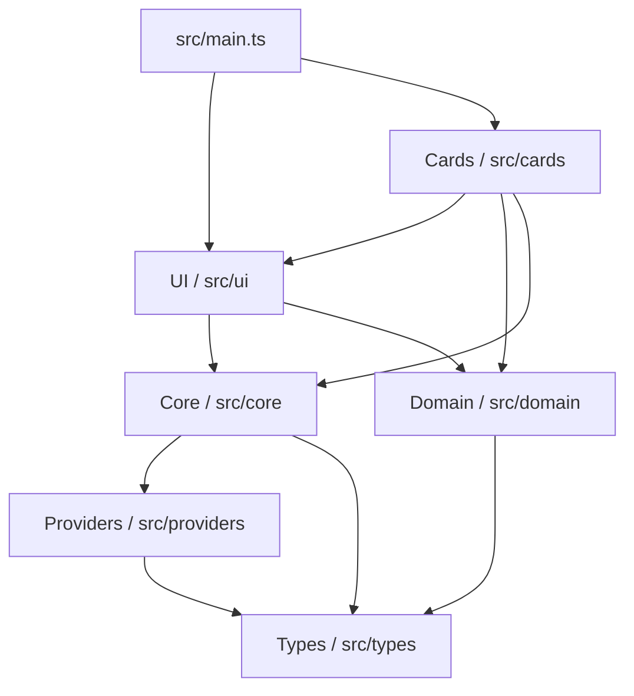
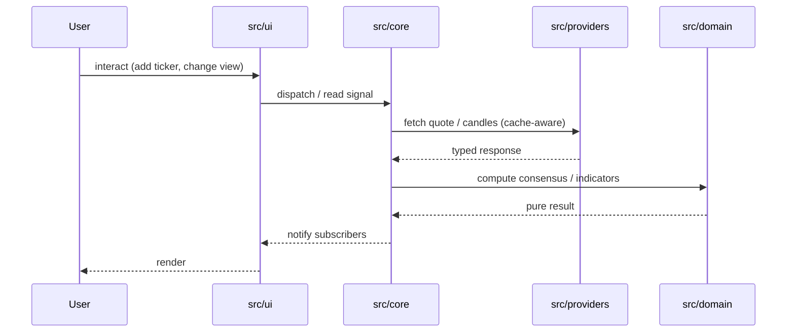

# Architecture

CrossTide Web is a browser-based stock monitoring dashboard built with vanilla TypeScript and Vite.
It follows a strict layered architecture, keeps the production bundle small, and ships as a single
self-contained PWA.

## Layered architecture



**Dependency rule:** each layer may only import from layers below it. The domain layer is pure
(zero side effects, no DOM access).

## Runtime data flow



## Directory layout

```text
src/
├── domain/         pure calculators (SMA, EMA, RSI, MACD, consensus, …)
├── core/           state, cache, config, fetch, idb, sync-queue, csp, sri, …
├── providers/      market-data adapters (Yahoo, Polygon, Finnhub, …)
├── cards/          composable UI cards (chart, screener, alerts, …)
├── ui/             DOM helpers, accessibility, formatting
├── types/          shared interfaces (DailyCandle, ConsensusResult, …)
├── styles/         tokens, base, layout, components
└── main.ts         bootstrap entry
```

## Tooling — single source of truth

| Concern        | File                            | Notes                                                              |
| -------------- | ------------------------------- | ------------------------------------------------------------------ |
| TypeScript     | `tsconfig.json`                 | strict + `exactOptionalPropertyTypes` + `noUncheckedIndexedAccess` |
| Bundler        | `vite.config.ts`                | Vite 8, oxc minifier, ES2022                                       |
| Tests          | `vitest.config.ts`              | happy-dom, v8 coverage, 90 % thresholds                            |
| Linting (TS)   | `eslint.config.mjs`             | ESLint 10 flat + typescript-eslint 8, `--max-warnings 0`           |
| Linting (CSS)  | `.stylelintrc.json`             | inline rule set (no external `extends`)                            |
| Linting (HTML) | `.htmlhintrc`                   | inline rule set                                                    |
| Linting (MD)   | `.markdownlint.json`            | `default: true`, allow common HTML elements                        |
| Format         | `.prettierrc`                   | repo-local; `npm run format:check` is the gate                     |
| Bundle budget  | `scripts/check-bundle-size.mjs` | 200 KB gzipped JS                                                  |

The repo is fully self-contained: `git clone` → `npm ci` → `npm run ci` works on any machine.

## CI / CD

- **`.github/workflows/ci.yml`** — install → typecheck → lint (TS+CSS+HTML+MD+Prettier) → tests
  → build → bundle check → upload `dist/` and coverage artifacts. PRs also run
  `dependency-review-action`.
- **`.github/workflows/release.yml`** — on tag `v*`, re-runs the gates, zips `dist/` into
  `crosstide-vX.Y.Z.zip`, generates a SHA-256 sidecar, and publishes a GitHub Release with both
  files.
- **`.github/workflows/pages.yml`** — pushes to `main` deploy the latest build to GitHub Pages.
- **`.github/dependabot.yml`** — weekly npm + github-actions update PRs, grouped by dev/prod.

## Quality gates

Local and CI both enforce, with **zero waivers**:

- 0 TypeScript errors (`npm run typecheck`)
- 0 ESLint warnings (`npm run lint`)
- 0 Stylelint warnings (`npm run lint:css`)
- 0 HTMLHint findings (`npm run lint:html`)
- 0 markdownlint findings (`npm run lint:md`)
- Prettier clean (`npm run format:check`)
- 1772 unit tests pass (`npm test`), v8 coverage thresholds met
- Production build under 200 KB gzipped JS (`npm run check:bundle`)
