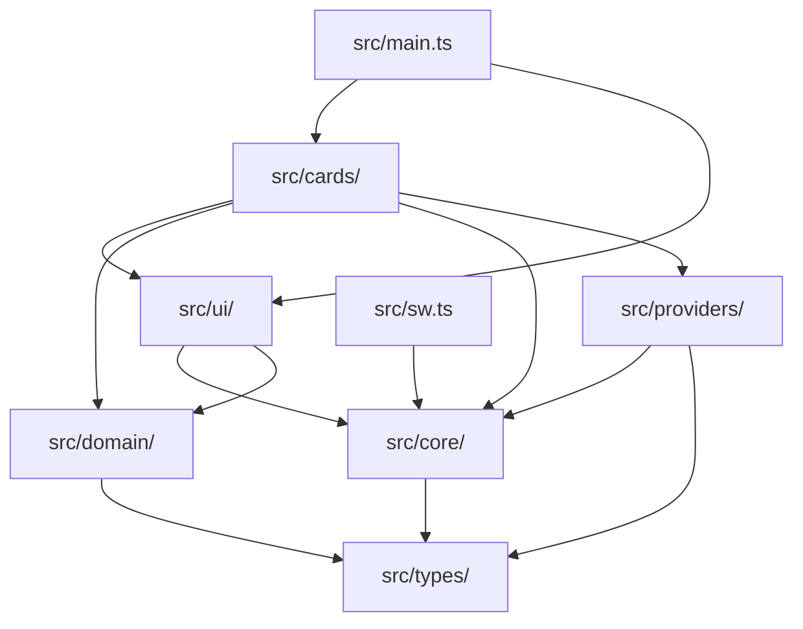
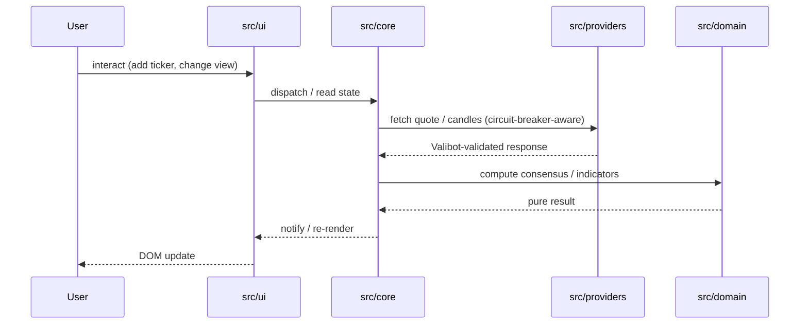

# Architecture

CrossTide Web is a browser-based stock monitoring dashboard built with vanilla TypeScript and
Vite. It follows a strict layered architecture, ships as a fully-offline PWA, and has zero
third-party runtime dependencies beyond `valibot` (3 KB gz).

> **Last updated:** v6.7.0

---

## 1. Layered dependency graph



**Dependency rule (enforced by ESLint `import/no-restricted-paths`):**

| Layer | May import from |
|---|---|
| `types/` | nothing |
| `domain/` | `types/` |
| `core/` | `types/`, `domain/` |
| `providers/` | `types/`, `core/` |
| `ui/` | `types/`, `core/` |
| `cards/` | `types/`, `domain/`, `core/`, `providers/`, `ui/` |

Violations fail CI.

---

## 2. Runtime data flow



---

## 3. Directory layout

```text
src/
├── types/          domain.ts — DailyCandle, ConsensusResult, WatchlistEntry …
├── domain/         pure calculators: SMA, EMA, RSI, MACD, ADX, Bollinger,
│                   consensus-engine, risk-ratios, equity-curve …
├── core/           state, cache, config, csp-builder, idb, lru-cache,
│                   tiered-cache, storage-pressure, fetch, circuit-breaker,
│                   keyboard, notifications, share-state, token-bucket,
│                   sync-queue, worker-rpc, web-vitals …
├── providers/      Yahoo, Finnhub, Alpha Vantage, CoinGecko, Stooq adapters
│                   + chain.ts (circuit-breaker fan-out)
├── cards/          Composable UI cards — lazy-loaded per route:
│                   chart, watchlist, consensus, screener, heatmap, alerts,
│                   portfolio, risk, backtest, consensus-timeline,
│                   provider-health, settings …
├── ui/             router, theme, toast, command-palette, watchlist table,
│                   sparkline, sortable, treemap-layout, palettes …
├── styles/         tokens.css, base.css, layout.css, components.css
├── sw.ts           Service worker (Workbox-compatible, compiled separately)
└── main.ts         Bootstrap: config → router → cards → keyboard → SW
```

---

## 4. Routing & card registry

Routes use the **History API** (`src/ui/router.ts`).
Every route maps to a card module loaded via lazy `import()`:

| Route | Card module |
|---|---|
| `/watchlist` | built-in (watchlist table in `main.ts`) |
| `/consensus` | `cards/consensus-card.ts` |
| `/chart` | `cards/chart-card.ts` |
| `/alerts` | `cards/alerts-card.ts` |
| `/heatmap` | `cards/heatmap.ts` |
| `/screener` | `cards/screener.ts` |
| `/portfolio` | `cards/portfolio.ts` |
| `/risk` | `cards/risk-card.ts` (Sortino, max DD, CAGR, Calmar) |
| `/backtest` | `cards/backtest-card.ts` (MA crossover, equity curve) |
| `/consensus-timeline` | `cards/consensus-timeline.ts` |
| `/provider-health` | `cards/provider-health.ts` |
| `/settings` | `cards/settings-card.ts` |

The registry (`cards/registry.ts`) returns `{ mount(el, ctx) }` for each entry.
Cards are never destroyed on route change — they are hidden/shown via CSS.

---

## 5. Security headers

All responses (CF Pages HTTP headers, dev server, preview server) enforce the same policy.
**Source of truth: `src/core/csp-builder.ts`** — regenerate with `node scripts/gen-csp.mjs`.

| Header | Value summary |
|---|---|
| `Content-Security-Policy` | `default-src 'self'`; no inline scripts; `wasm-unsafe-eval` for future WASM |
| `Permissions-Policy` | camera, geolocation, mic, payment all `()` |
| `X-Content-Type-Options` | `nosniff` |
| `X-Frame-Options` | `DENY` |
| `Referrer-Policy` | `strict-origin-when-cross-origin` |
| `COEP` | `same-origin` |
| `COOP` | `same-origin` |
| `HSTS` | `max-age=31536000; includeSubDomains` |

The `<meta http-equiv="Content-Security-Policy">` in `index.html` mirrors the same policy as
a defence-in-depth fallback for GitHub Pages (which cannot serve HTTP headers).

---

## 6. Storage strategy

| Tier | Tech | Use | TTL |
|---|---|---|---|
| L1 | `Map` + `TieredCache` L1 | Hot quotes, computed series | Session |
| L2 | `localStorage` (via `TieredCache`) | Config, theme, last route | Persistent |
| L3 | `IndexedDB` (`core/idb.ts`) | Candle history, alerts, portfolio | LRU 50 MB |
| L4 | Service Worker Cache API | App shell + API SWR responses | Per-strategy |

`createStoragePressureMonitor()` polls `navigator.storage.estimate()` every 60 s.
When usage exceeds **80%**, it evicts the oldest 20 `TieredCache` entries and shows
a user-facing toast. `requestPersistentStorage()` is called on first ticker add.

---

## 7. PWA / Service Worker

`src/sw.ts` is compiled by Vite as a separate entry (`dist/sw.js`).
It uses a custom `tsconfig.sw.json` with `lib: ["WebWorker"]`.

- Precaches the app shell (HTML, CSS, JS)
- NetworkFirst strategy for `/api/*` routes
- CacheFirst for static assets
- Background sync via `core/sync-queue.ts` (IDB-backed retry queue)

---

## 8. URL share-state

`core/share-state.ts` encodes the active route + card state into a `?s=` URL parameter
(base64url-encoded JSON). `Shift+S` copies the current view's share link; the URL is
restored automatically on next page load.

---

## 9. Tooling

| Concern | File | Notes |
|---|---|---|
| TypeScript | `tsconfig.json` | strict + `exactOptionalPropertyTypes` + `noUncheckedIndexedAccess` + `verbatimModuleSyntax` |
| SW TypeScript | `tsconfig.sw.json` | Separate, `lib: ["WebWorker"]` |
| Bundler | `vite.config.ts` | Vite 8, oxc minifier, ES2022 |
| Tests | `vitest.config.ts` | happy-dom, v8 coverage, ≥90% thresholds |
| Linting (TS) | `eslint.config.mjs` | ESLint 10 flat + typescript-eslint 8, `--max-warnings 0` |
| Linting (CSS) | `.stylelintrc.json` | Stylelint 16 |
| Linting (HTML) | `.htmlhintrc` | HTMLHint |
| Linting (MD) | `.markdownlint.json` | markdownlint-cli2 |
| Format | `.prettierrc` | `npm run format:check` is CI gate |
| Bundle budget | `scripts/check-bundle-size.mjs` | ≤ 200 KB gz initial JS |
| Security headers | `scripts/gen-csp.mjs` | Regenerates `public/_headers` from source of truth |
| Commits | `commitlint.config.mjs` | Conventional Commits enforced in CI |
| Changelog | `.changeset/` | Changesets-based version bumps |

---

## 10. CI / CD

```
ci.yml
  commitlint        → verifies commit message format
  typecheck         → tsc --noEmit (main + sw tsconfigs)
  lint              → eslint / stylelint / htmlhint / markdownlint / prettier
  test              → vitest run --coverage (1 800+ tests, ≥90% coverage)
  e2e               → playwright (10 flows + axe zero-violations gate)
  lighthouse        → lhci autorun (perf ≥90, a11y ≥95, best ≥95, SEO ≥90)
  build             → vite build
  bundle            → check-bundle-size.mjs (≤200 KB gz)
  dependency-review → on PRs only

release.yml  → on tag v*, re-runs gates → dist.zip + SHA-256 → GitHub Release
pages.yml    → on push main → deploy dist/ to GitHub Pages
```

---

## 11. Quality gates (zero waivers)

- 0 TypeScript errors
- 0 ESLint / Stylelint / HTMLHint / markdownlint warnings
- Prettier clean
- 1 800+ unit tests pass; v8 coverage thresholds met
- Playwright E2E: 10 flows pass; 0 axe serious/critical violations
- Lighthouse: perf ≥ 90, a11y ≥ 95, best-practices ≥ 95, SEO ≥ 90
- Bundle ≤ 200 KB gz initial JS

---

## 12. Performance budget

| Asset | Budget | Gate |
|---|---|---|
| JS initial | ≤ 180 KB gz | `check:bundle` |
| Lazy card chunk | ≤ 50 KB gz each | build |
| CSS | ≤ 30 KB gz | build |
| LCP (4G mid Android) | ≤ 1.8 s | Lighthouse CI |
| INP p75 | ≤ 200 ms | Lighthouse CI |
| CLS | ≤ 0.05 | Lighthouse CI |
